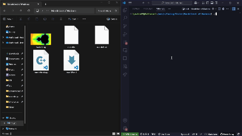

# Mandelbrot of Madness

## 📜 Deskripsi

Program ini menghasilkan gambar fraktal **Himpunan Mandelbrot** (dan opsional Himpunan Julia) dengan parameter yang dapat dikustomisasi.
Rendering dilakukan per-piksel, sehingga cocok untuk **paralelisasi** karena setiap piksel dihitung secara independen (*embarrassingly parallel*).

Program memiliki:

* **Implementasi serial** (tanpa OpenMP)
* **Implementasi paralel CPU** menggunakan OpenMP
* Dukungan output gambar dalam format BMP

---

## ⚙️ Fitur

* Pilihan jenis fraktal:

  * **Mandelbrot** (default)
  * **Julia** (`--type julia`)
* Pengaturan resolusi, iterasi maksimum, posisi pusat, dan skala
* Beberapa **palette warna** bawaan + custom
* Multi-threading dengan OpenMP
* Benchmark waktu eksekusi untuk membandingkan mode serial vs paralel

---

## 🛠️ Kompilasi

### Build dengan OpenMP (default)

```bash
make
```

### Build tanpa OpenMP

```bash
make noomp
```

### Bersihkan hasil kompilasi

```bash
make clean
```

---

## ▶️ Menjalankan Program

### Format Umum

```bash
./mandelbrot [options]
```

### Opsi Tersedia

```
--w <int>               image width (default 1920)
--h <int>               image height (default 1080)
--maxiter <int>         max iterations (default 1000)
--cx <float>            center X (default -0.75)
--cy <float>            center Y (default 0.0)
--scale <float>         half-width in complex plane (default 1.5)
--type <mandelbrot|julia> (default mandelbrot)
--jre <float>           Julia c real (default -0.8)
--jim <float>           Julia c imag (default 0.156)
--threads <int>         CPU threads (default HW concurrency)
--backend <auto|omp|threads|serial> (default auto)
--palette <smooth|original|fire|bw|gradient|banded>
--colors  <#RRGGBB,#RRGGBB,...>  (for gradient/banded)
--widths  <w1,w2,...>            (for banded; default all 12)
--feather <0..1>                 (banded softness, default 1)
--hue <float>  --sat <float>  --val <float>  (global HSV tweaks)
--out <filename.bmp>    output BMP file (default fractal.bmp)
```

### Contoh

Render fraktal Mandelbrot ukuran 800×600:

```bash
./mandelbrot --w 800 --h 600 --out mandelbrot.bmp
```

Render fraktal Julia ukuran 1920×1080 dengan parameter tertentu:

```bash
./mandelbrot --type julia --jre -0.7 --jim 0.27015 --out julia.bmp
```

---

## 📊 Benchmark

| Versi         | Resolusi  | Iterasi Max | Threads | Waktu (detik) | Speedup |
| ------------- | --------- | ----------- | ------- | ------------- | ------- |
| Serial        | 1920×1080 | 1000        | 1       | 1.74354       | 1.00x   |
| OpenMP (auto) | 1920×1080 | 1000        | 12      | 0.15841       | 11.01x  |


---

## 📷 Video Demo dan Screenshot

*Tekan gif di bawah ini untuk video demonstrasi Julia*

[](https://drive.google.com/file/d/1vfzw92ENSBD0lisXgEZHeH7E8zHOID98/view?usp=sharing)

### Hasil Render


